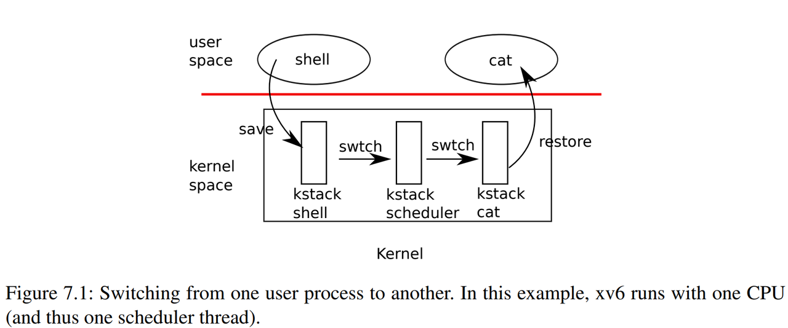

## 3. 进程的上下文切换



图7.1概述了从一个用户进程（旧进程）切换到另一个用户进程（新进程）所涉及的步骤：

- 一个到旧进程内核线程的用户-内核转换（系统调用或中断）
- 一个到当前CPU调度程序线程的上下文切换
- 一个到新进程内核线程的上下文切换
- 一个返回到用户级进程的陷阱

调度程序在旧进程的内核栈上执行是**不安全的**：其他一些核心可能会唤醒进程并运行它，而在两个不同的核心上使用同一个栈将是一场灾难，因此xv6调度程序在每个CPU上都有一个专用线程（保存寄存器和栈）。

在本节中，我们将研究在**内核线程**和**调度程序线程**之间切换的机制。

## 4. 内核线程和调度程序线程的切换

从一个线程切换到另一个线程需要保存旧线程的CPU寄存器，并恢复新线程先前保存的寄存器；**栈指针**和**程序计数器**被保存和恢复的事实意味着CPU将切换栈和执行中的代码。

函数`swtch`为内核线程切换执行保存和恢复操作。`swtch`对线程没有直接的了解；它只是保存和恢复寄存器集，称为**上下文（contexts）**。当某个进程要放弃CPU时，该进程的内核线程调用`swtch`来保存自己的上下文并返回到调度程序的上下文。

每个上下文都包含在一个`struct context`（**_kernel/proc.h_**:2）中，这个结构体本身包含在一个进程的`struct proc`或一个CPU的`struct cpu`中。

```c
// Saved registers for kernel context switches.

struct context {

  uint64 ra;

  uint64 sp;

  // callee-saved

  uint64 s0;

  uint64 s1;

  uint64 s2;

  uint64 s3;

  uint64 s4;

  uint64 s5;

  uint64 s6;

  uint64 s7;

  uint64 s8;

  uint64 s9;

  uint64 s10;

  uint64 s11;

};
```

`Swtch`接受两个参数：`struct context *old`和`struct context *new`。它将当前寄存器保存在`old`中，从`new`中加载寄存器，然后返回。

让我们跟随一个进程通过`swtch`进入调度程序。我们在第4章中看到，中断结束时的一种可能性是`usertrap`调用了`yield`。依次地：`Yield`调用`sched`，`sched`调用`swtch`将当前上下文保存在`p->context`中，并切换到先前保存在`cpu->scheduler`（**_kernel/proc.c_**:517）中的调度程序上下文。

```c
// Switch to scheduler.  Must hold only p->lock
// and have changed proc->state. Saves and restores
// intena because intena is a property of this
// kernel thread, not this CPU. It should
// be proc->intena and proc->noff, but that would
// break in the few places where a lock is held but
// there's no process.

void
sched(void)
{

  int          intena;

  struct proc *p = myproc();

  if(!holding(&p->lock))

    panic("sched p->lock");

  if(mycpu()->noff != 1)

    panic("sched locks");

  if(p->state == RUNNING)

    panic("sched running");

  if(intr_get())

    panic("sched interruptible");

  intena = mycpu()->intena;

  swtch(&p->context, &mycpu()->context);

  mycpu()->intena = intena;

}
```

`swtch`的实现很简单，a0存储了旧上下文的地址，而a1则存储了新上下文的地址：

```c
# Context switch
#   void swtch(struct context *old, struct context *new);
# Save current registers in old. Load from new.

.globl swtch

swtch:
        sd ra, 0(a0)
        sd sp, 8(a0)
        sd s0, 16(a0)
        sd s1, 24(a0)
        sd s2, 32(a0)
        sd s3, 40(a0)
        sd s4, 48(a0)
        sd s5, 56(a0)
        sd s6, 64(a0)
        sd s7, 72(a0)
        sd s8, 80(a0)
        sd s9, 88(a0)
        sd s10, 96(a0)
        sd s11, 104(a0)

  

        ld ra, 0(a1)
        ld sp, 8(a1)
        ld s0, 16(a1)
        ld s1, 24(a1)
        ld s2, 32(a1)
        ld s3, 40(a1)
        ld s4, 48(a1)
        ld s5, 56(a1)
        ld s6, 64(a1)
        ld s7, 72(a1)
        ld s8, 80(a1)
        ld s9, 88(a1)
        ld s10, 96(a1)
        ld s11, 104(a1)
        ret
```

`Swtch`（**_kernel/swtch.S_**:3）只保存被调用方保存的寄存器（callee-saved registers）；调用方保存的寄存器（caller-saved registers）通过调用C代码保存在栈上（如果需要）。`Swtch`知道`struct context`中每个寄存器字段的偏移量。它不保存程序计数器。但`swtch`保存`ra`寄存器，该寄存器保存调用`swtch`的返回地址。现在，`swtch`从新进程的上下文中恢复寄存器，该上下文保存前一个`swtch`保存的寄存器值。当`swtch`返回时，它返回到由`ra`寄存器指定的指令，即新线程以前调用`swtch`的指令。另外，它在新线程的栈上返回。

在我们的示例中，`sched`调用`swtch`切换到`cpu->scheduler`，即每个CPU的调度程序上下文。调度程序上下文之前通过`scheduler`对`swtch`（**_kernel/proc.c_**:475）的调用进行了保存。当我们追踪`swtch`到返回时，他返回到`scheduler`而不是`sched`，并且它的栈指针指向当前CPU的调用程序栈（scheduler stack）。