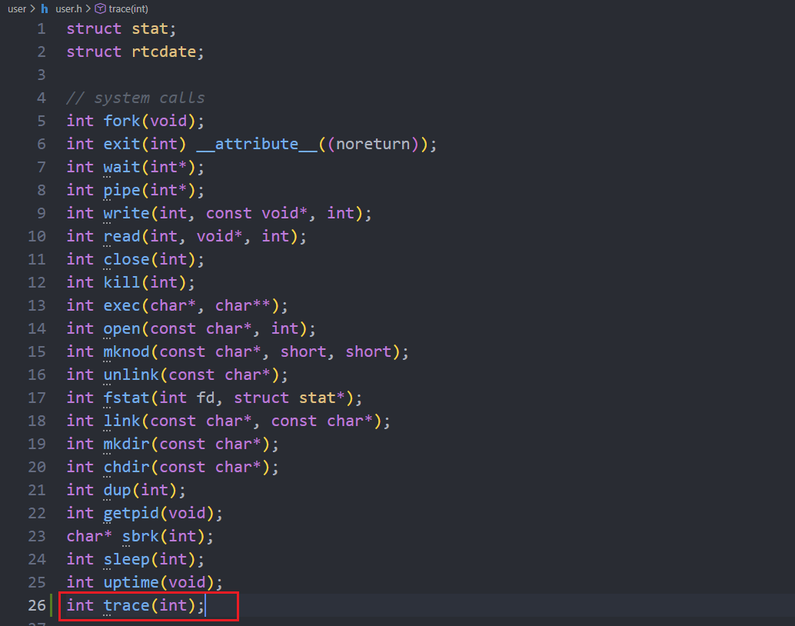
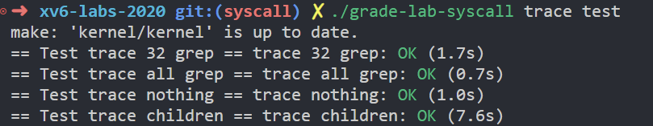

## 1. 如何注册新的系统调用？

### a. 添加函数原型

这是本实验的第一步，我们可以看到，在用户目录下有一个`trace.c`，这是我们使用系统调用sys_trace的位置。

```c
#include "kernel/param.h"

#include "kernel/types.h"

#include "kernel/stat.h"

#include "user/user.h"

  

int

main(int argc, char *argv[])

{

  int i;

  char *nargv[MAXARG];

  

  if(argc < 3 || (argv[1][0] < '0' || argv[1][0] > '9')){

    fprintf(2, "Usage: %s mask command\n", argv[0]);

    exit(1);

  }

  

  if (trace(atoi(argv[1])) < 0) {

    fprintf(2, "%s: trace failed\n", argv[0]);

    exit(1);

  }

  for(i = 2; i < argc && i < MAXARG; i++){

    nargv[i-2] = argv[i];

  }

  exec(nargv[0], nargv);

  exit(0);

}
```

我们可以看到使用系统调用trace的位置：

```c
if (trace(atoi(argv[1])) < 0)
```

因此可以推断它的调用函数原型是：

```c
int trace(int);
```

我们的第一步，是对我们的系统调用trace进行注册，找到`user.h`，先添加这一原型：



### b. 添加存根

然后，我们需要在`usys.pl`这一Perl脚本中添加trace的存根，经过这两步操作，用户空间可以通过trace函数过渡到内核态：

```perl
#!/usr/bin/perl -w

  

# Generate usys.S, the stubs for syscalls.

  

print "# generated by usys.pl - do not edit\n";

  

print "#include \"kernel/syscall.h\"\n";

  

sub entry {

    my $name = shift;

    print ".global $name\n";

    print "${name}:\n";

    print " li a7, SYS_${name}\n";

    print " ecall\n";

    print " ret\n";

}

entry("fork");

entry("exit");

entry("wait");

entry("pipe");

entry("read");

entry("write");

entry("close");

entry("kill");

entry("exec");

entry("open");

entry("mknod");

entry("unlink");

entry("fstat");

entry("link");

entry("mkdir");

entry("chdir");

entry("dup");

entry("getpid");

entry("sbrk");

entry("sleep");

entry("uptime");

# 添加的存根
entry("trace");
```

这个脚本的作用非常简单，就是根据ABI将对应的值存入寄存器并利用`ecall`过渡到内核态，如果你观察它生成的汇编指令，就会发现这么几行：

```asm
.global trace

trace:

 li a7, SYS_trace

 ecall

 ret
```

它的详解如下：

#### 1. `.global trace`

- **含义**：声明 `trace` 为全局符号。
- **详解**：这告诉链接器（Linker），`trace` 这个标签不仅在当前的汇编文件内可见，还可以被其他文件（比如你的 `user/trace.c`）引用。
- **关联**：正是有了这一行，你在 C 语言里调用 `trace(mask)` 时，编译器才能找到这个汇编入口。
    

#### 2. `trace:`

- **含义**：定义一个标签（Label）。
    
- **详解**：这是代码执行的起点。当你在 C 代码中调用 `trace()` 函数时，CPU 的程序计数器（PC）就会跳转到这里。
    

#### 3. `li a7, SYS_trace`

- **含义**：将系统调用号载入寄存器 `a7`。
    
- **详解**：`li` 是 Load Immediate（载入立即数）的缩写。`SYS_trace` 是你在 `kernel/syscall.h` 中定义的宏（例如数字 22）。
    
- **关键点**：**`a7` 寄存器在 RISC-V 中专门用来传递“系统调用号”**。内核就是通过读取 `a7` 的值来判断你要调用的究竟是 `fork`、`read` 还是 `trace`。
    

#### 4. `ecall`

- **含义**：Environment Call（执行环境调用）。
- **详解**：这是整段代码最核心的指令。
    
    - **权限切换**：它会触发一个硬件异常，使 CPU 从用户态切换到内核态。
    - **硬件跳转**：硬件会自动跳到内核预设的异常处理入口（在 xv6 中是 `kernel/trampoline.S`）。
    - **现场保存**：当前的寄存器状态会被保存，以便后续内核处理参数。
        

#### 5. `ret`

- **含义**：Return（函数返回）。
- **详解**：当内核处理完系统调用逻辑，并通过 `sret` 指令返回到用户态后，代码会从 `ecall` 的下一行继续执行。
- **结果**：`ret` 会让程序跳回到 `user/trace.c` 中调用 `trace()` 的位置，继续执行后面的用户代码。此时，系统调用的返回值已经躺在 `a0` 寄存器里了。

由此，我们进入内核。

## 2. 在内核中执行syscall

### a. xv6内核如何对syscall进行分发？

```c
static uint64 (*syscalls[])(void) = {

[SYS_fork]    sys_fork,

[SYS_exit]    sys_exit,

[SYS_wait]    sys_wait,

[SYS_pipe]    sys_pipe,

[SYS_read]    sys_read,

[SYS_kill]    sys_kill,

[SYS_exec]    sys_exec,

[SYS_fstat]   sys_fstat,

[SYS_chdir]   sys_chdir,

[SYS_dup]     sys_dup,

[SYS_getpid]  sys_getpid,

[SYS_sbrk]    sys_sbrk,

[SYS_sleep]   sys_sleep,

[SYS_uptime]  sys_uptime,

[SYS_open]    sys_open,

[SYS_write]   sys_write,

[SYS_mknod]   sys_mknod,

[SYS_unlink]  sys_unlink,

[SYS_link]    sys_link,

[SYS_mkdir]   sys_mkdir,

[SYS_close]   sys_close,

};
```

这个数据结构是 xv6 内核中的 **系统调用函数指针数组**。它是内核分发系统调用的“地图”或“路由表”。

这个数组存储的是**函数指针**。

- **类型**：`uint64 (*)(void)`。这意味着数组里的每个元素都指向一个接收“无参数”并返回 `uint64`（通常是系统调用的返回值）的内核函数。
- **对应关系**：它将“系统调用号”（如 `SYS_fork`）映射到内核中实际执行该功能的函数（如 `sys_fork`）。

当内核执行syscall时，它经过以下分发逻辑：

```c
void

syscall(void)

{

  int num;

  struct proc *p = myproc();

  num = p->trapframe->a7;

  if(num > 0 && num < NELEM(syscalls) && syscalls[num]) {

    p->trapframe->a0 = syscalls[num]();

  } else {

    printf("%d %s: unknown sys call %d\n",

            p->pid, p->name, num);

    p->trapframe->a0 = -1;

  }

}
```

利用寄存器a7存储系统调用编号，取出对应的函数并进行执行，再把返回值保存在寄存器a0中。

### b. 我们要如何实现逻辑？

题中提示我们，要先添加trace的宏，在`kernel/syscall.h`中，定义了系统调用的宏：

```c
#define SYS_trace  22
```

之后，我们在其他部分就可以路由到trace了。

trace的逻辑很简单，我们需要将掩码mask保存到proc结构体中，以便在执行其他系统调用时能够查看它是否被标记为traced，这里用了二进制压缩，每一位（位数与我们的宏定义相同）标记一个syscall。

```c
// Per-process state

struct proc {

  struct spinlock lock;

  

  // p->lock must be held when using these:

  enum procstate state;        // Process state

  struct proc *parent;         // Parent process

  void *chan;                  // If non-zero, sleeping on chan

  int killed;                  // If non-zero, have been killed

  int xstate;                  // Exit status to be returned to parent's wait

  int pid;                     // Process ID

  

  // these are private to the process, so p->lock need not be held.

  uint64 kstack;               // Virtual address of kernel stack

  uint64 sz;                   // Size of process memory (bytes)

  pagetable_t pagetable;       // User page table

  struct trapframe *trapframe; // data page for trampoline.S

  struct context context;      // swtch() here to run process

  struct file *ofile[NOFILE];  // Open files

  struct inode *cwd;           // Current directory

  char name[16];               // Process name (debugging)

  int tracemask;               // The mask trace syscall needs

};
```

我们需要通过trace系统调用存入mask，以便后续的系统调用被追踪，在syscall函数的逻辑中，一旦我们发现这个调用被追踪，就打印它的信息：

```c
void syscall(void)

{

  int num;

  struct proc *p = myproc();

  

  num = p->trapframe->a7;

  if (num > 0 && num < NELEM(syscalls) && syscalls[num])

  {

    p->trapframe->a0 = syscalls[num]();

  }

  else

  {

    printf("%d %s: unknown sys call %d\n",

           p->pid, p->name, num);

    p->trapframe->a0 = -1;

  }

  // trace logic

  if (p->tracemask & 1 << num)

    printf("%d: syscall %s -> %d\n", p->pid, syscall_names[num], p->trapframe->a0);

}
```

## 3. 实现trace syscall

### a. 掩码处理

我们在syscall中确保了根据掩码判断是否打印调用信息，我们现在要做的就是将掩码存入proc结构体中。不过首先我们需要在创建进程时对掩码初始化，找到allocproc函数：

```c
// Look in the process table for an UNUSED proc.

// If found, initialize state required to run in the kernel,

// and return with p->lock held.

// If there are no free procs, or a memory allocation fails, return 0.

static struct proc*

allocproc(void)

{

  struct proc *p;

  

  for(p = proc; p < &proc[NPROC]; p++) {

    acquire(&p->lock);

    if(p->state == UNUSED) {

      goto found;

    } else {

      release(&p->lock);

    }

  }

  return 0;

  

found:

  p->pid = allocpid();

  

  // Allocate a trapframe page.

  if((p->trapframe = (struct trapframe *)kalloc()) == 0){

    release(&p->lock);

    return 0;

  }

  

  // An empty user page table.

  p->pagetable = proc_pagetable(p);

  if(p->pagetable == 0){

    freeproc(p);

    release(&p->lock);

    return 0;

  }

  

  // Set up new context to start executing at forkret,

  // which returns to user space.

  memset(&p->context, 0, sizeof(p->context));

  p->context.ra = (uint64)forkret;

  p->context.sp = p->kstack + PGSIZE;

  

  p->tracemask = 0;

  return p;

}
```

在最后一行添加初始化命令。

同时不要忘了，fork逻辑中，子进程也需要复制父进程的掩码，因此找到fork的实现，添加复制语句：

```c
// Create a new process, copying the parent.

// Sets up child kernel stack to return as if from fork() system call.

int

fork(void)

{

  int i, pid;

  struct proc *np;

  struct proc *p = myproc();

  

  // Allocate process.

  if((np = allocproc()) == 0){

    return -1;

  }

  

  // Copy user memory from parent to child.

  if(uvmcopy(p->pagetable, np->pagetable, p->sz) < 0){

    freeproc(np);

    release(&np->lock);

    return -1;

  }

  np->sz = p->sz;

  

  np->parent = p;

  

  // copy saved user registers.

  *(np->trapframe) = *(p->trapframe);

  

  // Cause fork to return 0 in the child.

  np->trapframe->a0 = 0;

  

  // increment reference counts on open file descriptors.

  for(i = 0; i < NOFILE; i++)

    if(p->ofile[i])

      np->ofile[i] = filedup(p->ofile[i]);

  np->cwd = idup(p->cwd);

  

  safestrcpy(np->name, p->name, sizeof(p->name));

  

  pid = np->pid;

  

  np->state = RUNNABLE;

  

  release(&np->lock);

  

  // add tracemask copy

  np->tracemask = p->tracemask;

  

  return pid;

}
```

在最后添加复制tracemask的操作。

### b. 函数实现

syscall下的函数实现就很简单了：

```c
uint64

sys_trace(void)

{

  int mask;

  if (argint(0, &mask) < 0)

    return -1;

  myproc()->tracemask = mask;

  return 0;

}
```

实现完成后在syscall中注册就好了，这里不再赘述。

注意，在打印时，我们需要一个将代号反向映射回调用名的一个映射表：

```c
// map the macro to syscall name

static char *syscall_names[] = {

    [SYS_fork] "fork",

    [SYS_exit] "exit",

    [SYS_wait] "wait",

    [SYS_pipe] "pipe",

    [SYS_read] "read",

    [SYS_kill] "kill",

    [SYS_exec] "exec",

    [SYS_fstat] "fstat",

    [SYS_chdir] "chdir",

    [SYS_dup] "dup",

    [SYS_getpid] "getpid",

    [SYS_sbrk] "sbrk",

    [SYS_sleep] "sleep",

    [SYS_uptime] "uptime",

    [SYS_open] "open",

    [SYS_write] "write",

    [SYS_mknod] "mknod",

    [SYS_unlink] "unlink",

    [SYS_link] "link",

    [SYS_mkdir] "mkdir",

    [SYS_close] "close",

    [SYS_trace] "trace",

};
```

## 4. 通过测试

