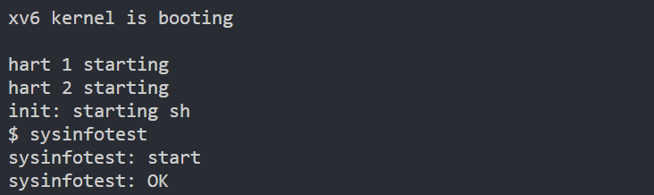

## 1. 注册系统调用

首先按照trace调用相同的方式注册这一系统调用，不再赘述，它的原型为：

```c
struct sysinfo;
int sysinfo(struct sysinfo*);
```

注意要先声明一下该结构体，不需要引入头文件，只需告诉编译器这是一个系统指针就行。

下面仍然在分发逻辑和映射表中添加sysinfo，使得能够正确进行调用。

## 2. 编写逻辑

我们从用户输入拿到需要的指针，再通过copyout函数把内核栈上的数据拷贝到用户提供的虚拟地址中，大致的逻辑如下，我们只需要实现查找空闲内存和统计进程数的函数就可以了。

```c
uint64

sys_sysinfo(void)

{

  struct proc *p = myproc();

  struct sysinfo info;

  uint64 uinfo;

  if (argaddr(0, &uinfo) < 0)

    return -1;

  info.freemem = kcount_freemem();

  info.nproc = count_procs();

  if (copyout(p->pagetable, uinfo, (char *)&info, sizeof(info)) < 0)

    return -1;

  return 0;

}
```

copyout的定义如下：

```c
// Copy from kernel to user.

// Copy len bytes from src to virtual address dstva in a given page table.

// Return 0 on success, -1 on error.

int

copyout(pagetable_t pagetable, uint64 dstva, char *src, uint64 len);

```

注释已经把功能说得很清楚了。

## 3. kcount_freemem()

本质是对内存页链表的遍历：

```c
uint64

kcount_freemem(void)

{

  struct run *r;

  uint64 count = 0;

  // Must be locked! Prevent others from applying/releasing memory while counting

  acquire(&kmem.lock);

  r = kmem.freelist;

  while (r)

  {

    count++;

    r = r->next;

  }

  release(&kmem.lock);

  return count * PGSIZE;

}
```

这里用了和Linux内核中一样的技巧，这种做法被称作“嵌入式链表”：
- **逻辑翻转**：不是“链表包含数据”，而是“数据包含链表节点”。
- **代码复用**：
    - 开发者只需要实现一套针对“链表节点结构体”的操作逻辑（插入、删除、遍历）。
    - 任何结构体（如进程 `proc`、文件 `file`）只要在内部嵌入这个节点，就立刻拥有了链表功能，而无需为每种类型重写一套链表代码。

如果要使用当前链表的数据，我们就可以计算偏移量：

假设你有一个大结构体 `struct proc`，链表节点 `list` 嵌在它的中间。如果你知道了 `list` 的内存地址，只要减去 `list` 在 `struct proc` 内部相对于起始位置的**偏移字节数**，就能得到 `struct proc` 的首地址。

在 Linux 内核中，这个操作被封装成了一个宏。虽然 xv6 没有直接提供这个宏，但理解它的实现对进阶非常有帮助：

```c
#define container_of(ptr, type, member) ({                      \
        const typeof( ((type *)0)->member ) *__mptr = (ptr);    \
        (type *)( (char *)__mptr - offsetof(type,member) );})
```

**它的三步逻辑：**

1. **`offsetof(type, member)`**：在编译时计算出 `member` 距离 `type` 开头有多少字节。
2. **指针转换**：将当前的节点指针 `ptr` 转换为 `char *`（因为 `char` 的大小是 1 字节，方便进行字节级的减法）。
3. **相减**：当前地址 - 偏移量 = 容器首地址。

同样的，当我们要计算偏移量时，可以采用如下公式：

```c
ptr_to_proc = (struct proc *)( (char *)p_node - (uint64)&((struct proc *)0)->node );
```

先把node强转为char类型，以支持字节级的操作。`(uint64)&((struct proc *)0)->node`用来计算偏移量。先把首地址设为0，再转成proc类型的指针，再取链表元素node，使用&取其地址，由于0为首地址，此时返回的地址就相当于node的偏移量，减去这个偏移量，就是真正的首地址。

其他的遍历操作很简单，记得加锁就好。

## 4. count_procs()

```c
uint64 count_procs(void)

{

  struct proc *p;

  uint64 count = 0;

  for (p = proc; p < &proc[NPROC]; p++)

  {

    // However, according to the concurrency specification of xv6,

    // it is recommended to add a lock to read the stable state.

    acquire(&p->lock);

    if(p->state!=UNUSED)

      count++;

    release(&p->lock);

  }

  return count;

}
```

直接对进程数组进行遍历，找出状态不为UNUSED的即可。

完成这两个函数后，记得在`defs.h`中添加声明。

## 5

挂起xv6后运行sysinfotest程序，可以看到通过测试：



至此通过Autograder，lab 2结束。