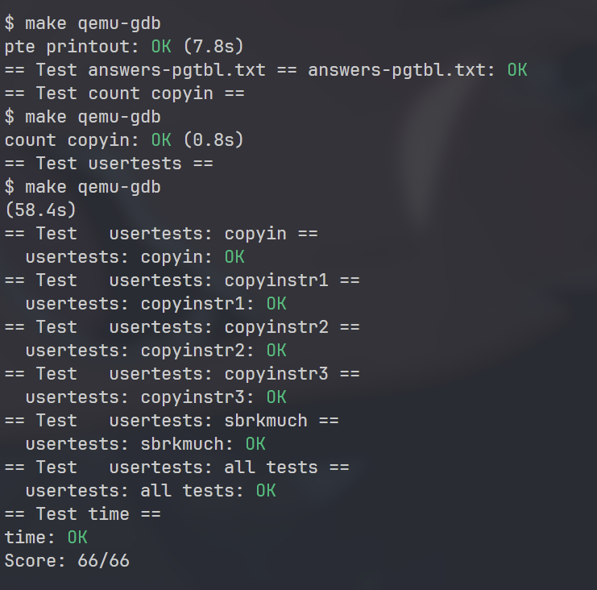

**先读题，先读题，先读题**

---

## 1. 翻译题干

题中说的很清楚，我们需要将定义在kernel/vm.c中的`copyin`的主题内容替换为对`copyin_new`的调用（在kernel/vmcopyin.c中定义）；对`copyinstr`和`copyinstr_new`执行相同的操作。

我们需要将用户的页表存放的内容完整映射到进程的内核页表中。用户进程的虚拟地址0对应的东西，在内核态的虚拟地址里也应该存在。

从本实验开始，我将vscode中的代码分析器前端换成了clangd，虽然编译仍然使用的gcc。同时配置好了一份差不多的xv6码风格式化文件：

```yaml
---

Language: Cpp

BasedOnStyle: LLVM

  

# --- 核心缩进与排版 (xv6 风格) ---

IndentWidth: 2

TabWidth: 8

UseTab: Never              # 严格使用空格

AlwaysBreakAfterReturnType: TopLevelDefinitions # 函数返回类型独占一行

AllowShortFunctionsOnASingleLine: None    # 防止短函数被强行压缩到一行

BreakBeforeBraces: Linux   # K&R 风格 (函数 { 换行，if { 不换行)

SpaceBeforeParens: Never   # if(x) 而不是 if (x)

PointerAlignment: Right     # char *p

ColumnLimit: 80            # 80 列宽限制

SortIncludes: false        # 禁止重排头文件

  

AlignConsecutiveDeclarations: true # 对齐变量声明和函数定义 (如 defs.h)

AlignConsecutiveMacros: true # 对齐宏定义 (如 uart.c 中的 #define)

AlignConsecutiveAssignments: true # 对齐赋值语句 (如 int a = 1; int b = 2;)

AlignTrailingComments: true # 对齐行尾注释 (让 // 都在同一列)

AlignEscapedNewlines: Left  # 对齐反斜杠 (用于多行宏定义)

---
```

你只需要在`.clang-format`中粘贴以上内容即可。

让我们大干一场吧。

---

## 2. 添加映射函数

我们最首先做的就是添加一个拷贝用户页表的函数，它的实现比较简单，可以参考内置的uvmcopy：

```c
  

// Given a user pagetable upt, only copy the

// page table entries to kernel page table kpt,

// start at 0x0, same sz as upt,

// returns 0 on success, -1 on failure

int kvmcopy_mappings(pagetable_t upt, pagetable_t kpt, uint64 sz)

{

  if (sz >= PLIC)

    panic("kvmcopy: uvm too large");

  

  pte_t *pte, *kpte;

  uint64 pa, i;

  for (i = 0; i < sz; i += PGSIZE)

  {

    if ((pte = walk(upt, i, 0)) == 0)

      panic("kvmcopy: upte should exist");

    if ((*pte & PTE_V) == 0)

      panic("kvmcopy: page not present");

    pa = PTE2PA(*pte);

    // create new kpte map to pte

    if ((kpte = walk(kpt, i, 1)) == 0)

    {

      uvmunmap(kpt, 0, i / PGSIZE, 0);

      return -1;

    }

    *kpte = PA2PTE(pa) | (PTE_FLAGS(*pte) & (~PTE_U));

  }

  return 0;

}
```

## 3. 对fork出手

题中说的很清楚，我们要对涉及修改用户页表的syscall进行处理，比较简单的一个是fork，剩的两个都耦合在一起，所以，我们先搞一下fork：

```c
// Create a new process, copying the parent.

// Sets up child kernel stack to return as if from fork() system call.

int

fork(void)

{

  int          i, pid;

  struct proc *np;

  struct proc *p = myproc();

  

  // Allocate process.

  if((np = allocproc()) == 0) {

    return -1;

  }

  

  // Copy user memory from parent to child.

  if(uvmcopy(p->pagetable, np->pagetable, p->sz) < 0) {

    freeproc(np);

    release(&np->lock);

    return -1;

  }

  // Copy user memory from user to kernel page table
  // HERE
  if(kvmcopy_mappings(np->pagetable, np->kpagetable, p->sz)) {

    freeproc(np);

    release(&np->lock);

    return -1;

  }

  np->sz = p->sz;

  

  np->parent = p;

  

  // copy saved user registers.

  *(np->trapframe) = *(p->trapframe);

  

  // Cause fork to return 0 in the child.

  np->trapframe->a0 = 0;

  

  // increment reference counts on open file descriptors.

  for(i = 0; i < NOFILE; i++)

    if(p->ofile[i])

      np->ofile[i] = filedup(p->ofile[i]);

  np->cwd = idup(p->cwd);

  

  safestrcpy(np->name, p->name, sizeof(p->name));

  

  pid = np->pid;

  

  np->state = RUNNABLE;

  

  release(&np->lock);

  

  return pid;

}
```

## 4. 意识到原来的有点问题

原先的kvmcopy默认从0开始，但是sbrk会增长一些内容，如果从头映射相当麻烦，所以，我们对其稍稍修改：

```c
// Given a user pagetable upt, only copy the

// page table entries to kernel page table kpt,

// start at 0x0, end at end_va,

// returns 0 on success, -1 on failure

int

kvmcopy_mappings(pagetable_t upt, pagetable_t kpt, uint64 va, uint64 end_va)

{

  if(end_va >= PLIC)

    panic("kvmcopy: uvm too large");

  va = PGROUNDUP(va);

  pte_t *pte, *kpte;

  uint64 pa, i;

  for(i = va; i < end_va; i += PGSIZE) {

    if((pte = walk(upt, i, 0)) == 0)

      panic("kvmcopy: upte should exist");

    if((*pte & PTE_V) == 0)

      panic("kvmcopy: page not present");

    pa = PTE2PA(*pte);

    // create new kpte map to pte

    if((kpte = walk(kpt, i, 1)) == 0) {

      uvmunmap(kpt, va, (i - va) / PGSIZE, 0);

      return -1;

    }

    *kpte = PA2PTE(pa) | (PTE_FLAGS(*pte) & (~PTE_U));

  }

  return 0;

}
```

## 5. 完成exec

这是本实验最耗时的部分，我们首先来改一下exec：

```c
  // Commit to the user image.

  oldpagetable      = p->pagetable;

  p->pagetable      = pagetable;

  p->sz             = sz;

  p->trapframe->epc = elf.entry; // initial program counter = main

  p->trapframe->sp  = sp;
  
  // Remove the original user memory space mapped
  // in the kernel page table

  kvmunmap(p->kpagetable, 0, PGROUNDUP(oldsz) / PGSIZE, 0);

  // Map new user memory space to kernel page table

  if(kvmcopy_mappings(p->pagetable, p->kpagetable, 0, p->sz) < 0) {

    // Rollback

    p->pagetable = oldpagetable;

    p->sz        = oldsz;

    goto bad;

  }
```

在exec()设置完这个页表并提交后，我们映射一下。

这里，由于uvmunmap在遇到页表中的空洞时会直接panic，而我们的用户空间当然存着许多空洞（比如保护页）。所以，我又写了一个kvmunmap，直接跳过空洞就好了，对于复制时也是如此，修改如下：

```c
// Given a user pagetable upt, only copy the

// page table entries to kernel page table kpt,

// start at va, end at end_va,

// returns 0 on success, -1 on failure

int

kvmcopy_mappings(pagetable_t upt, pagetable_t kpt, uint64 va, uint64 end_va)

{

  if(end_va >= PLIC)

    panic("kvmcopy: uvm too large");

  va = PGROUNDUP(va);

  pte_t *pte, *kpte;

  uint64 pa, i;

  for(i = va; i < end_va; i += PGSIZE) {

    if((pte = walk(upt, i, 0)) == 0)

      continue;

    if((*pte & PTE_V) == 0)

      continue;

    pa = PTE2PA(*pte);

    // create new kpte map to pte

    if((kpte = walk(kpt, i, 1)) == 0) {

      uvmunmap(kpt, va, (i - va) / PGSIZE, 0);

      return -1;

    }

    *kpte = PA2PTE(pa) | (PTE_FLAGS(*pte) & (~PTE_U));

  }

  return 0;

}

  

// Remove npages of mappings starting from va. va must be

// page-aligned. The mappings may not be exist.

// Used for removing user page map in the kernel page table.

// Optionally free the physical memory.

void

kvmunmap(pagetable_t pagetable, uint64 va, uint64 npages, int do_free)

{

  uint64 a;

  pte_t *pte;

  

  if((va % PGSIZE) != 0)

    panic("uvmunmap: not aligned");

  

  for(a = va; a < va + npages * PGSIZE; a += PGSIZE) {

    if((pte = walk(pagetable, a, 0)) == 0)

      continue;

    if((*pte & PTE_V) == 0)

      continue;

    if(PTE_FLAGS(*pte) == PTE_V)

      panic("uvmunmap: not a leaf");

    if(do_free) {

      uint64 pa = PTE2PA(*pte);

      kfree((void *)pa);

    }

    *pte = 0;

  }

}
```

同时我们要注意，第一个进程userinit是我们注入的，它的内核页表没法通过exec映射，所以，我们需要在userinit中手动映射，如下：

```c
// Set up first user process.

void

userinit(void)

{

  struct proc *p;

  p        = allocproc();

  initproc = p;

  // allocate one user page and copy init's instructions

  // and data into it.

  uvminit(p->pagetable, initcode, sizeof(initcode));

  p->sz = PGSIZE;

  // Sync maps to proc's kernel pagetable,

  // or the exec will fail
  
  // HERE

  if(kvmcopy_mappings(p->pagetable, p->kpagetable, 0, p->sz) < 0) {

    panic("userinit: kvmcopy_mappings");

  }

  // prepare for the very first "return" from kernel to user.

  p->trapframe->epc = 0;      // user program counter

  p->trapframe->sp  = PGSIZE; // user stack pointer

  safestrcpy(p->name, "initcode", sizeof(p->name));

  p->cwd = namei("/");

  p->state = RUNNABLE;

  release(&p->lock);

}
```

## 6. 完成sbrk

修改growproc如下：

```c
// Grow or shrink user memory by n bytes.

// Return 0 on success, -1 on failure.

int

growproc(int n)

{

  uint         sz, oldsz;

  struct proc *p = myproc();

  

  sz = p->sz;

  if(n > 0) {

    oldsz = sz;

    if((sz = uvmalloc(p->pagetable, sz, sz + n)) == 0) {

      return -1;

    }

    if(kvmcopy_mappings(p->pagetable, p->kpagetable, oldsz, oldsz + n) < 0) {

      // Rollback

      uvmdealloc(p->pagetable, sz, oldsz);

      return -1;

    }

  } else if(n < 0) {

    sz = uvmdealloc(p->pagetable, sz, sz + n);

    // Shrink kernel page table

    oldsz = p->sz;

    if(PGROUNDUP(sz) < PGROUNDUP(oldsz)) {

      int npages = (PGROUNDUP(oldsz) - PGROUNDUP(sz)) / PGSIZE;

      kvmunmap(p->kpagetable, PGROUNDUP(sz), npages, 0);

    }

  }

  p->sz = sz;

  return 0;

}
```

注意存一下oldsz，sz在uvmalloc后就更新了，之前疏忽我填错了，又拿GDB查了半天。

## 7. 通关

注意题上写得很清楚，我们需要将定义在kernel/vm.c中的`copyin`的主题内容替换为对`copyin_new`的调用（**在kernel/vmcopyin.c中定义**），我们不需要手动改，只需要替换一下就行了，手动直接在vm.c改计数器没办法统计。

这部分又浪费我一个小时，十分招笑。

我们也可以顺便看一下，新的copyin和copyinstr有多简单：

这是原来的：

```c
// Copy from user to kernel.

// Copy len bytes to dst from virtual address srcva in a given page table.

// Return 0 on success, -1 on error.

int

copyin(pagetable_t pagetable, char *dst, uint64 srcva, uint64 len)

{

  uint64 n, va0, pa0;

  

  while(len > 0) {

    va0 = PGROUNDDOWN(srcva);

    pa0 = walkaddr(pagetable, va0);

    if(pa0 == 0)

      return -1;

    n = PGSIZE - (srcva - va0);

    if(n > len)

      n = len;

    memmove(dst, (void *)(pa0 + (srcva - va0)), n);

  

    len -= n;

    dst += n;

    srcva = va0 + PGSIZE;

  }

  return 0;

}

  

// Copy a null-terminated string from user to kernel.

// Copy bytes to dst from virtual address srcva in a given page table,

// until a '\0', or max.

// Return 0 on success, -1 on error.

int

copyinstr(pagetable_t pagetable, char *dst, uint64 srcva, uint64 max)

{

  uint64 n, va0, pa0;

  int    got_null = 0;

  

  while(got_null == 0 && max > 0) {

    va0 = PGROUNDDOWN(srcva);

    pa0 = walkaddr(pagetable, va0);

    if(pa0 == 0)

      return -1;

    n = PGSIZE - (srcva - va0);

    if(n > max)

      n = max;

  

    char *p = (char *)(pa0 + (srcva - va0));

    while(n > 0) {

      if(*p == '\0') {

        *dst     = '\0';

        got_null = 1;

        break;

      } else {

        *dst = *p;

      }

      --n;

      --max;

      p++;

      dst++;

    }

  

    srcva = va0 + PGSIZE;

  }

  if(got_null) {

    return 0;

  } else {

    return -1;

  }

}
```

这是在vmcopyin中新的：

```c
// Copy from user to kernel.

// Copy len bytes to dst from virtual address srcva in a given page table.

// Return 0 on success, -1 on error.

int

copyin_new(pagetable_t pagetable, char *dst, uint64 srcva, uint64 len)

{

  struct proc *p = myproc();

  

  if(srcva >= p->sz || srcva + len >= p->sz || srcva + len < srcva)

    return -1;

  memmove((void *)dst, (void *)srcva, len);

  stats.ncopyin++; // XXX lock

  return 0;

}

  

// Copy a null-terminated string from user to kernel.

// Copy bytes to dst from virtual address srcva in a given page table,

// until a '\0', or max.

// Return 0 on success, -1 on error.

int

copyinstr_new(pagetable_t pagetable, char *dst, uint64 srcva, uint64 max)

{

  struct proc *p = myproc();

  char        *s = (char *)srcva;

  

  stats.ncopyinstr++; // XXX lock

  for(int i = 0; i < max && srcva + i < p->sz; i++) {

    dst[i] = s[i];

    if(s[i] == '\0')

      return 0;

  }

  return -1;

}
```

直接解引用让代码变得十分优雅。

最后，make grade一下吧：



如果你也要开始攻克这个实验，祝你一切顺利。

pgtbl实验的难度完全和前两个不是一个量级，但跌跌撞撞，我也算是完成了它。

特别鸣谢The Beatles的音乐，让我游走在一个个这样的夜晚。